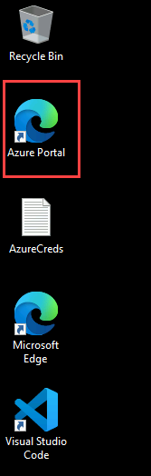

## Getting Started with Challenge

Welcome to Hack in a Day: Deploy Your AI Application in Production! We've prepared a seamless environment for you to explore and learn. Let's begin by making the most of this experience.

### Accessing Your Challenge Environment

Once you're ready to dive in, your virtual machine and challenge guide will be right at your fingertips within your web browser.

### Exploring Your Challenge Resources

To get a better understanding of your challenge resources and credentials, navigate to the Environment tab.

### Utilizing the Split Window Feature

For convenience, you can open the challenge guide in a separate window by selecting the Split Window button from the Top right corner.

### Managing Your Virtual Machine

Feel free to start, stop, or restart your virtual machine as needed from the Resources tab. Your experience is in your hands!

> **Note:** If the VM is not in use, please **deallocate** it to avoid unnecessary resource consumption.

## Let's Get Started Azure Portal

1. In the JumpVM, double-click on the **Azure Portal** browser shortcut which is created on the desktop.

   

1. On the **Sign into Microsoft Azure** tab, you will see the login screen. Enter the provided email or username, and click **Next** to proceed.

   - Email/Username: <inject key="AzureAdUserEmail"></inject>

     

1. Now, enter the following password and click on **Sign in**.

   - Password: <inject key="AzureAdUserPassword"></inject>

     

     >**Note:** If you see the Action Required dialog box, then select Ask Later option.
     
1. If you see the pop-up **Stay Signed in?**, click No.

   

1. Welcome to **Azure Portal**! You're now ready to start building your secure, production-ready AI application with enterprise-grade security.

1. The lab environment includes:
   - Azure subscription with Owner permissions
   - Pre-configured resource group for deployments
   - Access to Azure AI Foundry and Azure OpenAI Service
   - Pre-built chat application code (provided in Challenge 5)
   - Python 3.11 and VS Code pre-installed on JumpVM
   - Azure CLI for authentication
   - Azure Bastion for secure VM access

Now, click on the **Next** from lower right corner to move on next page.

## Happy Hacking!