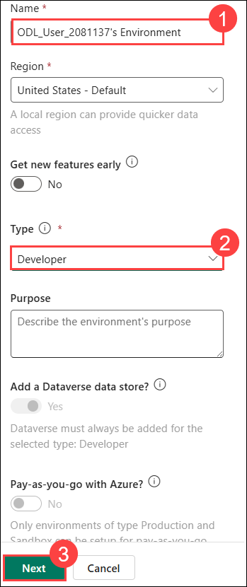

## Getting Started with Challenge

Welcome to Hack in a Day: Financial Insight & Risk Advisor Agent challenge! We've prepared a seamless environment for you to explore and learn. Let's begin by making the most of this experience.

### Accessing Your Challenge Environment

Once you're ready to dive in, your virtual machine and challenge guide will be right at your fingertips within your web browser.


### Exploring Your Challenge Resources

To get a better understanding of your challenge resources and credentials, navigate to the Environment tab.


### Utilizing the Split Window Feature

For convenience, you can open the challenge guide in a separate window by selecting the Split Window button from the top right corner.


### Managing Your Virtual Machine

Feel free to start, stop, or restart your virtual machine as needed from the Resources tab. Your experience is in your hands!


## Let's Get Started with Microsoft Copilot Studio

1. In the JumpVM, click on **Microsoft Edge** browser icon from the desktop.

   

1. Open a new browser tab and navigate to the Power Apps portal using the link below:

   ```
   https://make.powerapps.com/
   ```

1. On the **Sign into Microsoft** tab, you will see the login screen. Enter the provided email or username, and click **Next** to proceed.

   - Email/Username: **<inject key="AzureAdUserEmail"></inject>**

     

1. Now, enter the following password and click on **Sign in**.

   - Temporary Access Pass: **<inject key="AzureAdUserPassword"></inject>**

     
     
1. If you see the pop-up **Stay Signed in?**, click **No**.

   

1. If the **Welcome to Power Apps** pop-up appears, leave the default country/region selection and click **Get started**.

   

1. You have now successfully logged in to the Power Apps portal. Keep the portal open.

   

   > **Note:** We are signing in to the Power Apps portal because it automatically assigns a Developer license, which is required to create and use a Developer environment in the next steps.

1. Open a new browser tab, and then navigate to the Power Platform admin center.

   ```
   https://admin.powerplatform.microsoft.com
   ```

1. In the **Power Platform admin center**, select **Manage** from the left navigation pane.

   

1. In the Power Platform admin center, select **Environments (1)** from the left navigation pane, and then choose **New (2)** to create a new environment.

   

1. In the **New environment** pane, configure the environment with the following settings, and then select **Next (3)**:

   - Enter **ODL_User <inject key="Deployment ID" enableCopy="false"></inject>'s Environment** in the **Name (1)** field.
   - Select **Developer (2)** from the **Type** dropdown.

      

1. In the **Add Dataverse** pane, leave all settings as default, and then select **Save**.

   

   > **Environment Foundation:** This step creates the foundational environment that will support your agents with company-specific data and knowledge sources.

   > **Note:** Environment provisioning may take 10–15 minutes to complete. Wait until the status shows as ready before proceeding.

1. In the power **platform admin center**, select **Manage** from left menu and click on the environment with the name, ODL_User <inject key="Deployment ID" enableCopy="false"></inject>'s Environment.

   

1. In the environment page, click on **See all** under **S2S apps**.

   

1. In the next pane, click on **+ New app user**.

   

1. In the create a new app user pane, under **App**, click on **+ Add an app**.

   

1. From the list of apps, search for `https://cloudlabssandbox.onmicrosoft.com/cloudlabs.ai/` and select it.

   

1. Once done, under **Business unit** search for **org** and select the only business unit that comes in the list.

   

1. Beside **Security roles** click on **Edit** icon.

   

1. From the list of roles, search and select **System Administrator** and click on **Save**.

   

1. In the pop-up window, select **save**.

   

1. Review all the details and click on **Create**.

   

1. Navigate to **Microsoft Copilot Studio** by opening a new browser tab and using the link below:

   ```
   https://copilotstudio.microsoft.com
   ```

1. On the **Welcome to Microsoft Copilot Studio** screen, keep the default **country/region** selection and click **Get Started** to continue.

   

1. If the **Welcome to Copilot Studio!** pop-up appears, click **Skip** to continue to the main dashboard.

   

1. In Copilot Studio, open the environment picker **(1)**, expand **Supported environments (2)**, and select **ODL_User <inject key="Deployment ID" enableCopy="false"></inject>'s Environment (3)** to switch.

   

Now, click on the **Next** from lower right corner to move on next page.

## Happy Hacking!!
