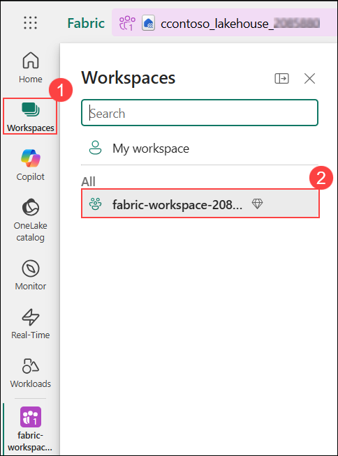
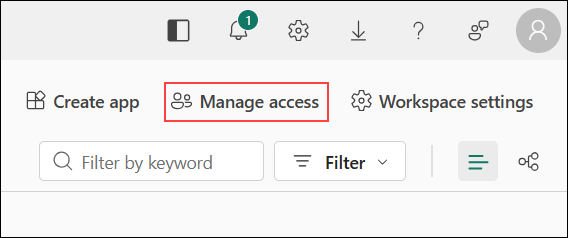
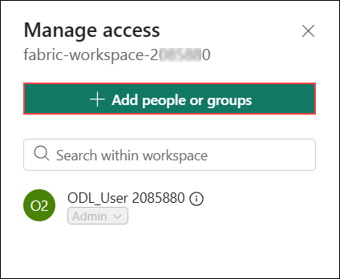
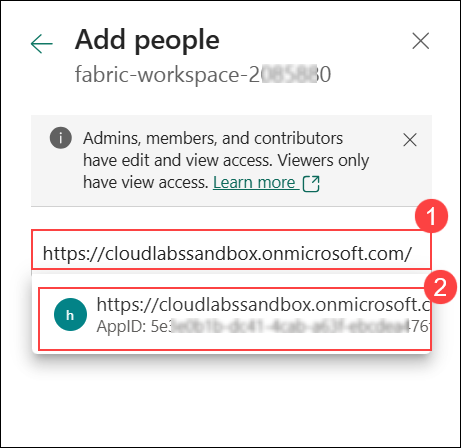
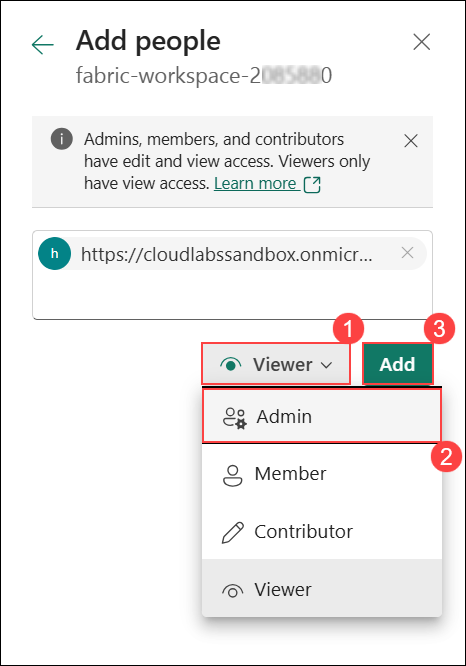
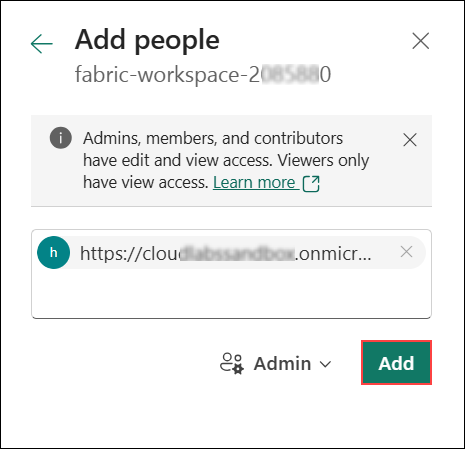
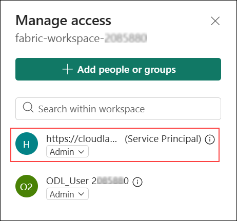

# Challenge 06: Build a Power BI Dashboard

## Introduction

Contoso's business stakeholders need intuitive, interactive dashboards to visualize sales trends, track regional performance, monitor operational KPIs, and analyze customer segments. Power BI, natively integrated with Microsoft Fabric, provides seamless connectivity to Gold layer tables without requiring data movement or duplication. In this final challenge, you will create a comprehensive Power BI dashboard that connects directly to your Fabric Lakehouse Gold layer, enabling business users to explore governed, high-quality data through beautiful visualizations.

## Challenge Objectives

- Connect Power BI to the Fabric Lakehouse Gold layer.
- Create a semantic model (dataset) from Gold layer tables.
- Build visualizations: sales trends, regional comparisons, KPIs, customer segments.
- Design an interactive dashboard with slicers and filters.
- Publish the dashboard to Power BI Service for organization-wide access.

## Steps to Complete

### Task: Prerequisite

1. Select **Workspaces (1)** from the left navigation pane, and then choose **fabric-workspace-<inject key="DeploymentID" enableCopy="false"/> (2)** from the list.

   

1. Select **Manage access** from the workspace menu.

   

1. In the **Manage access** pane, select **+ Add people or groups**.

   

1. In the **Add people** pane, enter **below URL** (1)** in the search box, and then select the displayed result (2).

   ```
   https://cloudlabssandbox.onmicrosoft.com
   ```

   

1. Select **Viewer (1)**, choose **Member (2)** from the dropdown, and then click **Add (3)**.

   

1. Select **Admin**, and then click **Add**.

   

1. In the **Manage access** pane, verify that the service principal is added with the **Admin** role.

   

### Part 1: Connect Power BI to Fabric Lakehouse

1. In the **Edge browser**, navigate to the **Microsoft Fabric** portal (if not already open):

   ```
   https://app.fabric.microsoft.com/
   ```

1. Navigate to your workspace: **fabric-workspace-<inject key="DeploymentID" enableCopy="false"/>**

1. Open your Lakehouse: **contoso-lakehouse-<inject key="DeploymentID" enableCopy="false"/>**

1. From the Lakehouse, click on **SQL analytics endpoint** in the top-right corner.

   > **Note:** This provides a T-SQL interface to your Delta Lake tables for Power BI connectivity.

1. Click **New semantic model** (formerly known as Dataset):

   - **Name**: **Contoso-Flight-Analytics-Model**

1. Select the following Gold layer tables:
   - fact_flights
   - fact_transactions
   - dim_customers
   - dim_geography
   - dim_time
   - kpi_customer_value
   - gold_customer_segments_ml (if Challenge 5 was completed)
   - gold_segment_summary (if Challenge 5 was completed)

   > **Note**: If you completed Challenge 5's Fabric Data Science ML modeling, you'll have ML-enriched customer segment tables for advanced behavioral analysis.

1. Click **Confirm** to create the semantic model.

<validation step="f499aee9-5db5-4792-ae27-8edcc1b19acf" />

> **Congratulations** on completing the Challenge! Now, it's time to validate it. Here are the steps:
> - Hit the Validate button for the corresponding Challenge. If you receive a success message, you can proceed to the next Challenge. 
> - If not, carefully read the error message and retry the step, following the instructions in the lab guide.
> - If you need any assistance, please contact us at cloudlabs-support@spektrasystems.com. We are available 24/7 to help.

### Part 2: Configure Relationships in Semantic Model

1. Once the semantic model opens, you'll see the **Model view**.

1. Create relationships between tables by dragging between fields:

   - **fact_flights[customer_key]** → **dim_customers[customer_key]**  
     Cardinality: Many-to-One (*)
   
   - **fact_transactions[customer_key]** → **dim_customers[customer_key]**  
     Cardinality: Many-to-One (*)
   
   - **fact_transactions[transaction_date]** → **dim_time[date]**  
     Cardinality: Many-to-One (*)
   
   - **kpi_customer_value[customer_key]** → **dim_customers[customer_key]**  
     Cardinality: Many-to-One (*)
   
   - **gold_customer_segments_ml[customer_key]** → **dim_customers[customer_key]** (if table exists)  
     Cardinality: One-to-One (1:1)

1. Verify that all relationships are **active** and have the correct **cross-filter direction**:

   - Set cross-filter direction to **Single** for all relationships (default)

1. Add calculated measures to the **fact_transactions** table:

   - Right-click **fact_transactions** → **New measure**
   
   ```DAX
   Total Revenue = SUM(fact_transactions[transaction_amount])
   ```
   
   ```DAX
   Total Transactions = COUNTROWS(fact_transactions)
   ```
   
   ```DAX
   Average Transaction Value = DIVIDE([Total Revenue], [Total Transactions], 0)
   ```
   
   ```DAX
   Completed Revenue = CALCULATE([Total Revenue], fact_transactions[status] = "completed")
   ```

1. Add calculated measures to the **fact_flights** table:

   - Right-click **fact_flights** → **New measure**
   
   ```DAX
   Total Flights = SUM(fact_flights[total_flights])
   ```
   
   ```DAX
   Total Loyalty Points = SUM(fact_flights[total_loyalty_points])
   ```
   
   ```DAX
   Total Distance KM = SUM(fact_flights[total_km_flown])
   ```
   
   ```DAX
   Average Flights Per Member = AVERAGE(fact_flights[total_flights])
   ```

1. Add calculated measures for **ML Segment Analysis** (if gold_customer_segments_ml exists):

   - Right-click **gold_customer_segments_ml** → **New measure**
   
   ```DAX
   Total Customers in Segments = COUNTROWS(gold_customer_segments_ml)
   ```
   
   ```DAX
   Average RFM Score = AVERAGE(gold_customer_segments_ml[recency_score]) + 
                       AVERAGE(gold_customer_segments_ml[frequency_score]) + 
                       AVERAGE(gold_customer_segments_ml[monetary_score])
   ```
   
   ```DAX
   High Value Customers = CALCULATE(
       COUNTROWS(gold_customer_segments_ml), 
       gold_customer_segments_ml[segment_name] IN {"Loyal Frequent Flyers", "Premium Elite Members"}
   )
   ```

1. **Save** the semantic model.

### Part 3: Create Power BI Report

1. From the semantic model, click **Create report** in the top ribbon.

1. The Power BI report canvas will open with your data model connected.

#### Page 1: Business Overview Dashboard

1. Add a **Card visual** for Total Revenue:
   - Drag **Total Revenue** measure to the canvas
   - Format: Currency, no decimals
   - Title: "Total Transaction Revenue"

1. Add three more **Card visuals** for KPIs:
   - **Total Flights**
   - **Total Loyalty Points**
   - **Total Transactions**

#### Page 2: Geographic & Loyalty Analysis

1. Add a new page: Click **+ Add page** at the bottom

1. Add a **Map visual** for Customer Distribution:
   - Location: **dim_customers[province]**, **dim_customers[country]**
   - Bubble size: **Total Flights**
   - Title: "Customer Distribution by Province"

1. Add a **Matrix visual** for geographic breakdown:
   - Rows: **dim_customers[province]**, **dim_customers[country]**
   - Columns: **dim_customers[loyalty_tier]**
   - Values: Count of **customer_key**, **Total Flights**, **Total Loyalty Points**
   - Title: "Geographic Loyalty Analysis"

### Part 3: Add Interactivity with Slicers

1. Go back to **Page 1: Sales Overview**

1. Add a **Slicer** for Year filter:
   - Field: **dim_time[year]**
   - Style: Dropdown
   - Position: Top-left corner

1. Add a **Slicer** for Region filter:
   - Field: **fact_transactions[region]**
   - Style: List
   - Position: Left side panel

### Part 4: Format and Polish the Dashboard

1. Apply consistent theme:
   - Go to **View** → **Themes**
   - Select a professional theme (e.g., "Executive")

1. Add report title and description:
   - Insert **Text box** at the top
   - Title: "Contoso Flight Loyalty & Customer Analytics Dashboard"
   - Subtitle: "Real-time insights from unified data platform"

### Part 5: Publish Dashboard to Power BI Service

1. Click **File** → **Save**
   - Report name: **Contoso-Flight-Loyalty-Dashboard**

1. Click **Publish** in the Home ribbon

1. Select destination workspace: **fabric-workspace-<inject key="DeploymentID" enableCopy="false"/>**

   > **Note:** Your workspace is using the Fabric capacity (F2 SKU) you deployed from Azure, which supports all publishing features.

1. Click **Select**

1. Once published, click **Open 'Contoso-Flight-Loyalty-Dashboard' in Power BI** to view in the service

<validation step="f5d9a7e3-f2cd-4603-82ce-b275098789c9" />
> **Congratulations** on completing the Challenge! Now, it's time to validate it. Here are the steps:
> - Hit the Validate button for the corresponding Challenge. If you receive a success message, you can proceed to the next Challenge. 
> - If not, carefully read the error message and retry the step, following the instructions in the lab guide.
> - If you need any assistance, please contact us at cloudlabs-support@spektrasystems.com. We are available 24/7 to help.

## Success Criteria

- Semantic model created from Fabric Lakehouse Gold layer tables (fact_flights, fact_transactions, dim_customers, dim_geography, dim_time, kpi_customer_value).
- ML-enriched tables included (gold_customer_segments_ml, gold_segment_summary) if Challenge 5 was completed.
- Relationships configured correctly between fact, dimension, and ML segment tables.
- Calculated DAX measures created for revenue, flights, loyalty points, and segment analysis.
- Multi-page interactive dashboard created:
  - Page 1: Business Overview (revenue, transactions, trends)
  - Page 2: Geographic & Loyalty Analysis (maps, matrices, distributions)
  - Page 3: ML Customer Segmentation (behavioral insights, RFM analysis)
- Slicers and filters implemented for user interactivity (Year, Region, Loyalty Tier, Customer Status, Segments).
- Dashboard published to Power BI Service successfully.
- Data accuracy validated between Power BI and source Lakehouse tables.
- ML segment visualizations display 5 distinct customer personas (if Challenge 5 completed).

## Additional Resources

- [Power BI and Microsoft Fabric Integration](https://learn.microsoft.com/fabric/get-started/power-bi-fabric-integration)
- [Create Reports in Power BI](https://learn.microsoft.com/power-bi/create-reports/)
- [DAX Functions Reference](https://learn.microsoft.com/dax/dax-function-reference)
- [Power BI Best Practices](https://learn.microsoft.com/power-bi/guidance/power-bi-optimization)
- [Semantic Models in Fabric](https://learn.microsoft.com/fabric/data-warehouse/semantic-models)

## Congratulations!

You have successfully built an **end-to-end unified analytics platform** using Microsoft Fabric, OneLake, Fabric Data Science, and Power BI!

### Real-World Applications:

This solution enables enterprise-grade analytics across:

- **Unified Data Platform** - Single source of truth with OneLake, eliminating data silos
- **Medallion Architecture** - Structured data quality layers (Bronze → Silver → Gold)
- **Integrated ML & Analytics** - Native Data Science capabilities within Fabric
- **Self-Service BI** - Business users empowered with governed, high-quality data
- **Scalable Architecture** - Cloud-native platform ready for enterprise-scale workloads
- **Real-Time Insights** - Direct connectivity eliminates ETL latency

### What You've Built:

**Bronze Layer**: Raw data ingestion from multiple sources  
**Silver Layer**: Cleansed, standardized, joined datasets  
**Gold Layer**: Business-ready dimensional models (Star Schema)  
**Fabric Data Science**: ML models for customer segmentation with MLflow tracking  
**Power BI Dashboards**: Interactive visualizations for business insights  

# Congratulations on completing this challenge!
