## Getting Started with Challenge

Welcome to Hack in a Day: Unified Data Foundation with Fabric challenge! We've prepared a seamless environment for you to explore and learn. Let's begin by making the most of this experience.

### Accessing Your Challenge Environment

Once you're ready to dive in, your virtual machine and challenge guide will be right at your fingertips within your web browser.

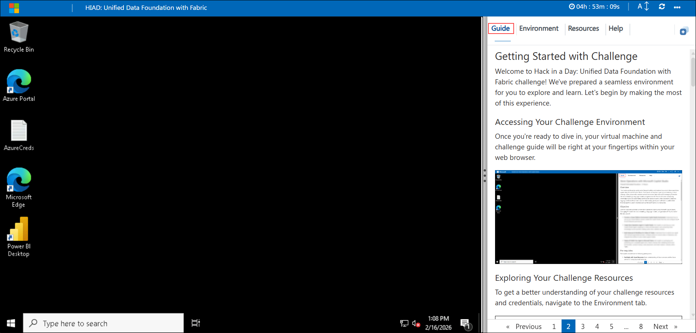

### Exploring Your Challenge Resources

To get a better understanding of your challenge resources and credentials, navigate to the Environment tab.


### Utilizing the Split Window Feature

For convenience, you can open the challenge guide in a separate window by selecting the Split Window button from the Top right corner


### Managing Your Virtual Machine

Feel free to start, stop, or restart your virtual machine as needed from the Resources tab. Your experience is in your hands!


> **Note:** If the VM is not in use, please **deallocate** it to avoid unnecessary resource consumption.

## Let's Get Started with Unified Data Foundation

1. In the JumpVM, click on **Microsoft Edge** browser shortcut which is created on desktop.

   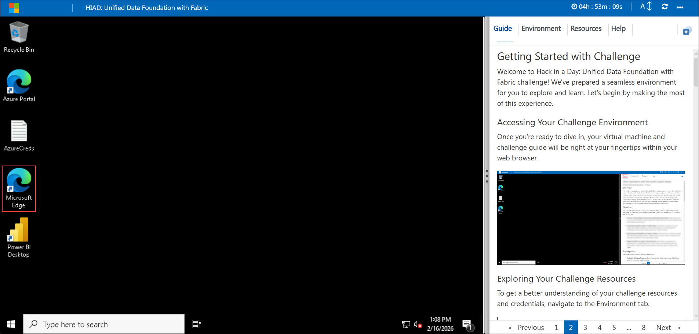

1. Navigate to the **Microsoft Fabric portal**:

   ```
   https://app.fabric.microsoft.com/
   ```

1. On the **Sign into Microsoft** tab, you will see the login screen. Enter the provided email or username, and click **Next** to proceed.

   - Email/Username: <inject key="AzureAdUserEmail"></inject>

     

1. Now, enter the following password and click on **Sign in**.

   - Password: <inject key="AzureAdUserPassword"></inject>

     

     >**Note:** If you see the Action Required dialog box, then select Ask Later option.
     
1. If you see the pop-up **Stay Signed in?**, click No.

   

1. On the **Enter your email** page, verify the **Email (1)** field is populated, and then select **Submit (2)**.

   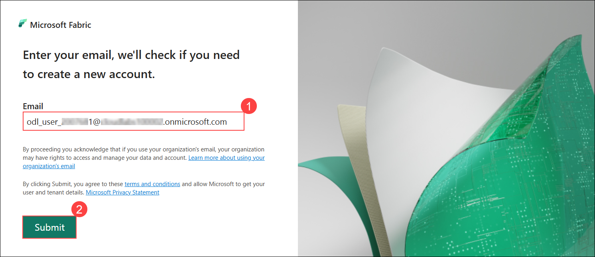

1. On the **Welcome to the Fabric view** dialog box, select **Start tour** to proceed.

   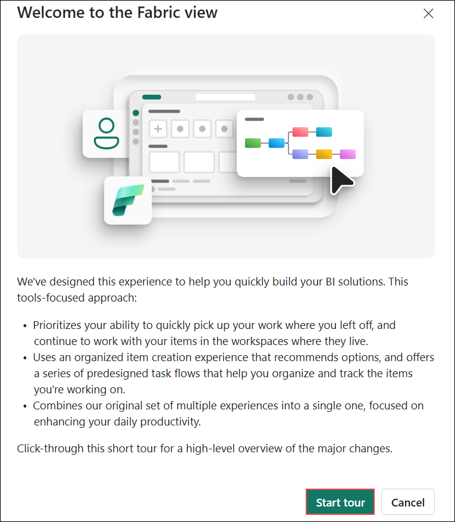

1. Select the **Profile (1)** icon, and then choose **Free trial (2)**.

   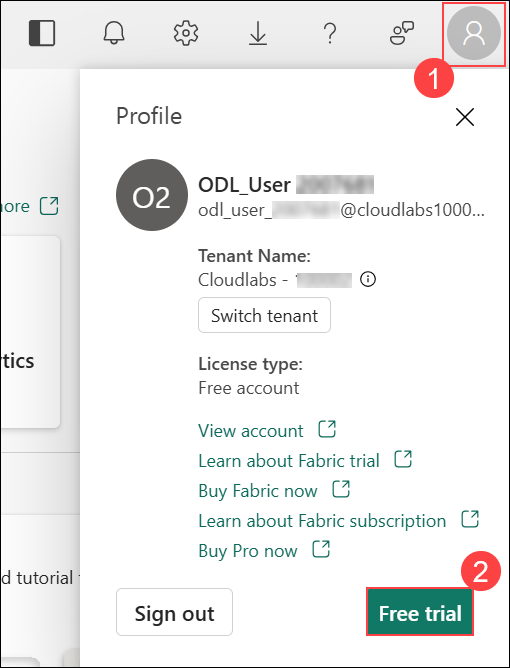

1. On the **Activate your 60-day free Fabric trial capacity** dialog box, review the **Trial capacity region**, and then select **Activate**.

   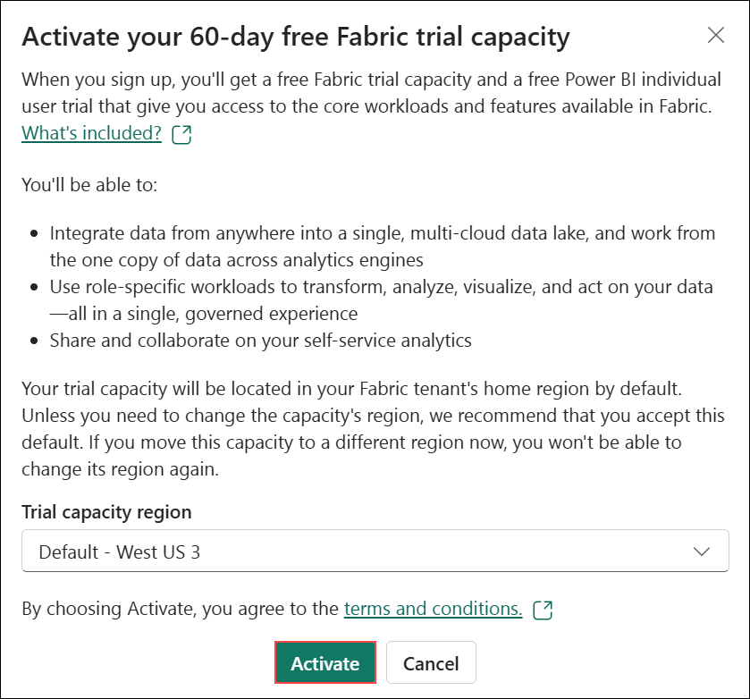

1. On the **Successfully upgraded to Microsoft Fabric** dialog box, select **OK**.

   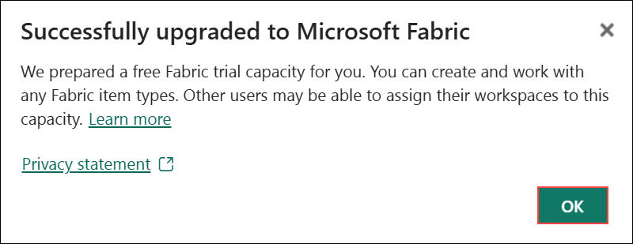

1. On the **Invite teammates to try Fabric to extend your trial** dialog box, select the **Close (X)** icon to dismiss the prompt.

   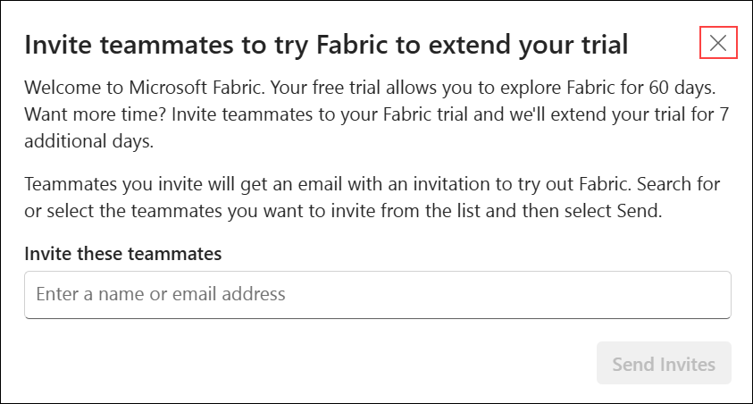

1. Select the **Profile (1)** icon, and verify that the **Fabric and Power BI trial status (2)** shows the trial is active.

   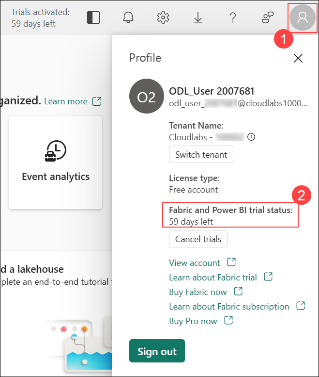

1. Welcome to **Microsoft Fabric**! You're now ready to start building your data lakehouse solution using Microsoft Fabric, OneLake, and the Medallion architecture for data engineering with flight loyalty and transaction data.

1. If you are unable to access the free trial, follow the steps below:

   1. Open a new browser tab, and navigate to the **Azure portal**.

   ```
   https://portal.azure.com/
   ```

   1. In the search bar, enter **Microsoft Fabric (1)**, and then select **Microsoft Fabric (2)** from the results.

      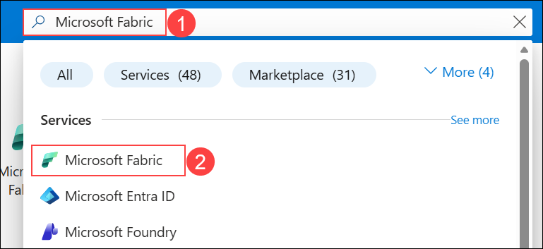
   
   1. On the **Microsoft Fabric** page, select **Create**.

      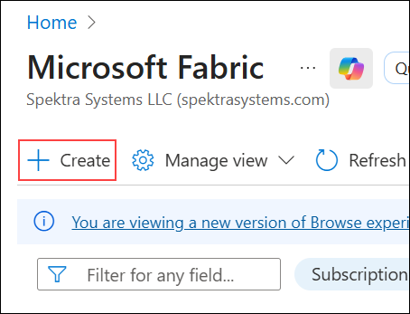

Now, click on the **Next** from lower right corner to move on next page.

## Happy Hacking!