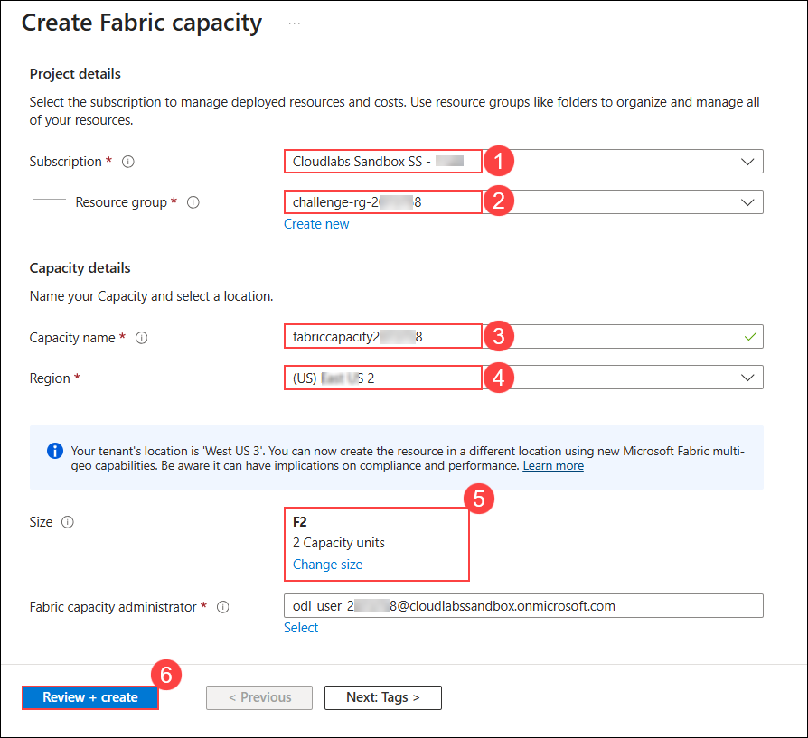
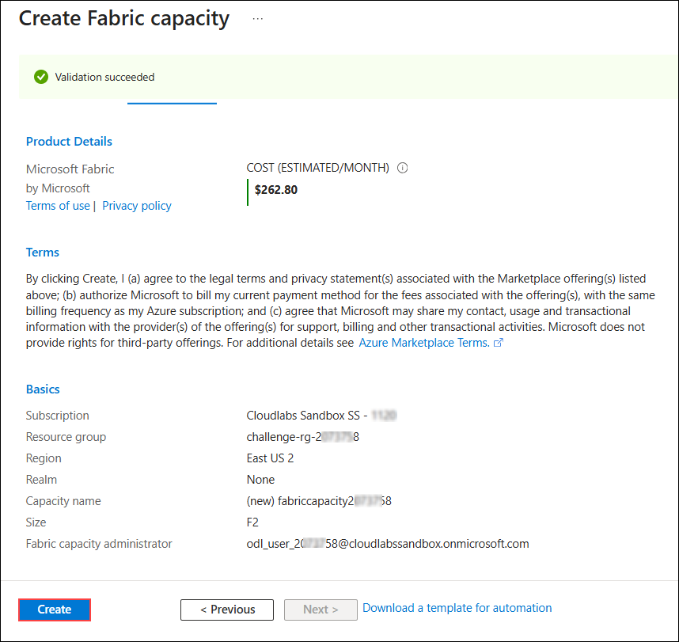

## Getting Started with Challenge

Welcome to Hack in a Day: Unified Data Foundation with Fabric challenge! We've prepared a seamless environment for you to explore and learn. Let's begin by making the most of this experience.

### Accessing Your Challenge Environment

Once you're ready to dive in, your virtual machine and challenge guide will be right at your fingertips within your web browser.


### Exploring Your Challenge Resources

To get a better understanding of your challenge resources and credentials, navigate to the Environment tab.


### Utilizing the Split Window Feature

For convenience, you can open the challenge guide in a separate window by selecting the Split Window button from the Top right corner


### Managing Your Virtual Machine

Feel free to start, stop, or restart your virtual machine as needed from the Resources tab. Your experience is in your hands!


> **Note:** If the VM is not in use, please **deallocate** it to avoid unnecessary resource consumption.

## Let's Get Started with Unified Data Foundation

1. In the JumpVM, click on **Microsoft Edge** browser shortcut which is created on desktop.

   

1. Navigate to the **Microsoft Fabric portal**:

   ```
   https://app.fabric.microsoft.com/
   ```

1. On the **Sign into Microsoft** tab, you will see the login screen. Enter the provided email or username, and click **Next** to proceed.

   - Email/Username: <inject key="AzureAdUserEmail"></inject>

     

1. Now, enter the following password and click on **Sign in**.

   - Password: <inject key="AzureAdUserPassword"></inject>

     

     >**Note:** If you see the Action Required dialog box, then select Ask Later option.
     
1. If you see the pop-up **Stay Signed in?**, click No.

   

1. On the **Enter your email** page, verify the **Email (1)** field is populated, and then select **Submit (2)**.

   

1. On the **Welcome to the Fabric view** dialog box, select **Start tour** to proceed.

   

1. Now in a new browser tab, navigate to the **Azure portal**.

   ```
   https://portal.azure.com/
   ```

If prompted to sign in, enter the provided credentials, and then click **Next** to proceed.

   - Email/Username: <inject key="AzureAdUserEmail"></inject>

   - Password: <inject key="AzureAdUserPassword"></inject>

1. In the search bar, enter **Microsoft Fabric (1)**, and then select **Microsoft Fabric (2)** from the results.

   

1. On the **Microsoft Fabric** page, select **Create**.

   

1. In the **Create Fabric capacity** page, configure the following settings:

   - **Subscription (1)**: Select the default subscription  
   - **Resource group (2)**: **challenge-rg-<inject key="DeploymentID" enableCopy="false"/>**  
   - **Capacity name (3)**: **fabriccapacity<inject key="DeploymentID" enableCopy="false"/>**  
   - **Region (4)**: Keep the ** default Region** 
   - **Size (5)**: Select **F2**  
   - Select **Review + create (6)**

      

1. On the **Microsoft Fabric** page, select **Create**.

   

Now, click on the **Next** from lower right corner to move on next page.

## Happy Hacking!